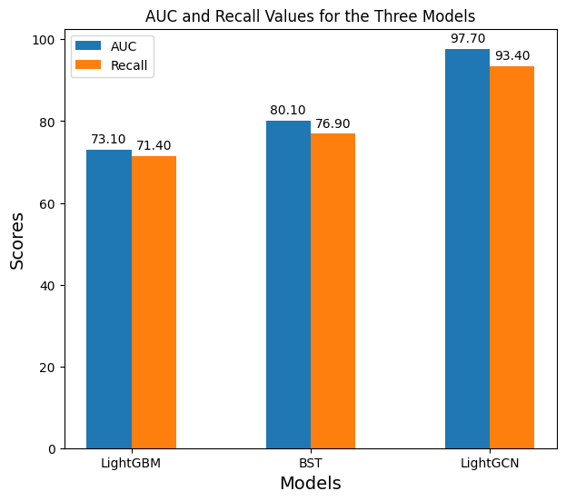

# engr-ALDA-Fall2023-P17
Repository containing the code for CSC 522 ALDA course project for project group 17

### Project Idea
We built a music recommendation system using the [Spotify Music Streaming Sessions dataset](https://www.aicrowd.com/challenges/spotify-sequential-skip-prediction-challenge/dataset_files). We explore three modeling strategies, namely:
- LightGBM
- Behaviour Sequence Transformer
- LightGCN

You can go through our full project report here [Project Report](https://github.com/PrasannaV710/SpotifyRecommendationSystem/blob/main/Report.pdf)

### Create environment
---
```
conda env create --file env.yaml
conda activate music-rec-sys
```
### Notebooks
Each modeling strategy has it's own corresponding notebook. We perform EDA before building models to ensure the conclusions from the analysis are taken into account when building the models. All the training and inference was performed in Google Colab to utilize GPU compute. Hence if there is any mismatch in package versions or any other error please raise an issue so we can look into it.

### Results


### Conclusions
Through this project, we understood that the performance of a model can be greatly impacted by how the data is structured. Our findings show that the use of graphs to visualize the relationship between the session and the tracks related to it can greatly improve the recommendation engine's quality. Our future work would involve applying the same process on the entire Spotify dataset instead of implementing it on a subset of the data. We also plan to leverage the use of a graph-based transformer and observe its performance.

Team members:
- Naren Sivakumar Rajalakshmi (nsivaku6@ncsu.edu)
- Srivathsan Govindarajan (sgovind7@ncsu.edu)
- Prasanna Venkatesh Thambuanantharaman (pthambu@ncsu.edu)
- Sri Roopa Ramesh Babu (srames25@ncsu.edu)

